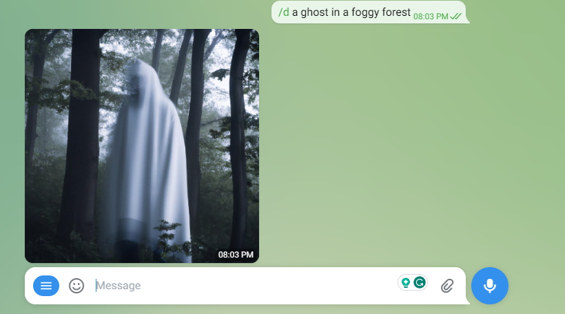
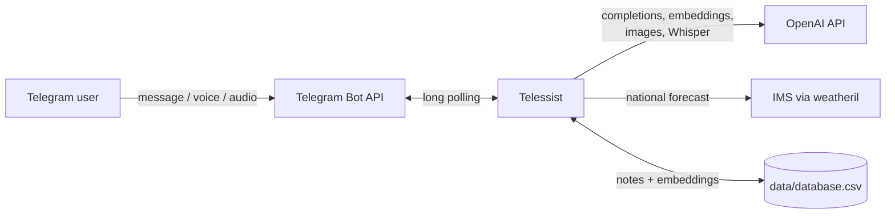

# Telessist

[](https://hub.docker.com/r/techblog/telessist)
[](LICENSE)

Telessist is a self-hosted Telegram bot that connects your chat to OpenAI. Send it a message and it answers with a GPT-3 completion. It can also save your personal notes, find them again with embedding-based semantic search, and answer questions based only on what you saved. On top of that it was built to generate images with DALL-E (now broken, see below), transcribes voice messages and audio files with Whisper, shows the Israeli national weather forecast from the [Israel Meteorological Service (IMS)](https://ims.gov.il/he), and reports your estimated OpenAI costs. Access is limited to the Telegram chat IDs you allow.

> [!WARNING]
> **Current limitation: the chat and question-answering features rely on a retired OpenAI model.**
> Telessist uses the legacy `openai==0.28.1` Python interface (`openai.Completion`, `openai.Image`, `openai.Audio`, `openai.embeddings_utils`) and the `text-davinci-003` completion model. OpenAI retired `text-davinci-003` in January 2024, so plain messages and `/q` questions no longer get an answer (the bot replies "aw snap something went wrong").
> The `/c` cost report reads `https://api.openai.com/dashboard/billing/usage`, an undocumented dashboard endpoint that does not accept regular API keys, so it is also expected to fail. <!-- TODO: verify -->
> Image generation (`/d`) is also broken: `openai.Image.create` sends no model, so it defaults to DALL-E 2, and OpenAI removed DALL-E 2 and DALL-E 3 from the API on 2026-05-12 (the `gpt-image` models replace them). The bot replies with the raw error text.
> Saving and searching notes (`text-embedding-ada-002`) and Whisper transcription use endpoints that still exist, but they have not been re-tested against the current API. <!-- TODO: verify -->

## Table of contents

- [Features](#features)
- [Screenshots](#screenshots)
- [How it works](#how-it-works)
- [Requirements](#requirements)
- [Installation](#installation)
- [Configuration](#configuration)
- [Usage](#usage)
- [Data storage](#data-storage)
- [Published images](#published-images)
- [Security and privacy](#security-and-privacy)
- [Troubleshooting](#troubleshooting)
- [Development](#development)
- [Contributing](#contributing)
- [Acknowledgments](#acknowledgments)
- [License](#license)

## Features

- **Chat with GPT-3**: any text message that does not start with `/` is sent to the OpenAI completions API (`text-davinci-003`, temperature 0.5, up to 500 tokens). See the limitation above.
- **Personal notes (`/s`)**: saves a note with a timestamp and its `text-embedding-ada-002` embedding to a local CSV file.
- **Semantic search (`/f`)**: returns the 3 saved notes most similar to your query (cosine similarity on embeddings).
- **Questions about your notes (`/q`)**: builds a prompt from the 3 most relevant notes and asks the model to answer based only on that context (temperature 0, up to 200 tokens).
- **Image generation (`/d`)**: generates one 1024x1024 image with the OpenAI image API (DALL-E 2 by default) and sends it back as a photo. See the limitation above: DALL-E 2 has been removed from the API.
- **Voice and audio transcription**: Telegram voice messages and audio files are converted to WAV with pydub/ffmpeg and transcribed with Whisper (`whisper-1`). Whisper detects the language automatically.
- **Weather (`/w`)**: the IMS national forecast for the next 4 days, in Hebrew, via [weatheril](https://pypi.org/project/weatheril/).
- **OpenAI cost report (`/c`)**: estimated spend for today, yesterday, the last 7 days and the last 30 days. See the limitation above.
- **Allowlist**: the bot only answers chats whose ID is in `ALLOWED_IDS`.
- **Docker images** for `linux/amd64` and `linux/arm64`.

### Components and frameworks

- [pyTelegramBotAPI](https://pypi.org/project/pyTelegramBotAPI/) (`telebot`) for the Telegram bot, using long polling.
- [OpenAI](https://pypi.org/project/openai/) Python client, pinned to `0.28.1`, for GPT-3 completions, embeddings, DALL-E and Whisper.
- [pandas](https://pypi.org/project/pandas/) and [NumPy](https://pypi.org/project/numpy/) for the notes store and similarity search.
- [pydub](https://pypi.org/project/pydub/) with ffmpeg for audio conversion.
- [weatheril](https://pypi.org/project/weatheril/) for the IMS weather forecast.
- [Loguru](https://pypi.org/project/loguru/) for logging.

## Screenshots

Image generation with `/d`:



More examples (help menu, weather, saving and searching notes) are in the [`examples`](examples) folder.

## How it works



1. `app.py` starts a `telebot` bot with `infinity_polling()`. No port is opened; the bot connects out to Telegram.
2. Every incoming text, voice or audio message is checked against `ALLOWED_IDS`. Messages from other chats are ignored silently.
3. `CommandHandler` routes text by its prefix (`/h`, `/q`, `/s`, `/f`, `/d`, `/c`, `/w`), and sends anything else to the completions API.
4. Notes are kept in a CSV file (`data/database.csv`) with the columns `time`, `message` and `ada_search` (the embedding).

## Requirements

- A Telegram bot token from [@BotFather](https://t.me/BotFather).
- An OpenAI API key.
- Your numeric Telegram chat ID (for `ALLOWED_IDS`).
- Either Docker, or Python 3 with `pip` and **ffmpeg** installed (pydub needs ffmpeg to convert audio).
  `requirements.txt` pins `pandas==1.5.3` and `openai==0.28.1`; pandas 1.5.3 publishes wheels only up to Python 3.11, so Python 3.11 or older is recommended for a local install. On Python 3.12, pandas 1.5.3 has to be built from source (the published `2.0.1` image did this on Python 3.12.1).

## Installation

Telessist can run as a Docker container or as a systemd service.

### 1. Create a Telegram bot and get the token

Open [Telegram](https://web.telegram.org/) and sign in to your account, or create a new one.

Enter @BotFather in the search tab and choose this bot (official Telegram bots have a blue checkmark next to their name).

[](https://github.com/t0mer/voicy/blob/main/screenshots/scr1-min.png?raw=true "@BotFather")

Click "Start" to activate the BotFather bot.

[](https://github.com/t0mer/voicy/blob/main/screenshots/scr2-min.png?raw=true "@start")

In response, you receive a list of commands to manage bots.
Choose or type the `/newbot` command and send it.

[](https://github.com/t0mer/voicy/blob/main/screenshots/scr3-min.png?raw=true "@newbot")

Choose a name for your bot; your subscribers will see it in the conversation. Then choose a username for your bot; the bot can be found by its username in searches. The username must be unique and end with the word "bot".

[](https://github.com/t0mer/voicy/blob/main/screenshots/scr4-min.png?raw=true "@username")

After you choose a suitable name, the bot is created. You receive a message with a link to your bot (`t.me/<bot_username>`), recommendations to set up a profile picture and description, a list of commands to manage your new bot, and the bot token.

[](https://github.com/t0mer/voicy/blob/main/screenshots/scr5-min.png?raw=true "@bot_username")

### 2. Find your chat ID

`ALLOWED_IDS` takes numeric Telegram chat IDs (for a private chat with the bot, this is your user ID; group chat IDs are negative). Telessist does not print the chat ID itself, so use any Telegram "user info" bot or the Bot API `getUpdates` method to find it.

### 3a. Run with Docker Compose

Create a `docker-compose.yaml` (an equivalent file is in this repository):

```yaml
services:
  telessist:
    image: techblog/telessist:latest
    container_name: telessist
    restart: always
    environment:
      - BOT_TOKEN=${BOT_TOKEN}       # Telegram bot token
      - OPENAI_KEY=${OPENAI_KEY}     # OpenAI API key
      - ALLOWED_IDS=${ALLOWED_IDS}   # Comma-separated Telegram chat IDs allowed to use the bot
    volumes:
      - ./telessist:/app/data        # Persists the notes database (database.csv)
```

Put the values in a `.env` file next to it (keep this file out of git):

```bash
BOT_TOKEN=<your-telegram-bot-token>
OPENAI_KEY=<your-openai-api-key>
ALLOWED_IDS=<chat-id-1>,<chat-id-2>
```

Then start it:

```bash
docker compose up -d
docker compose logs -f telessist
```

The bot does not listen on any port, so no `ports:` mapping is needed.

### 3b. Run with `docker run`

```bash
docker run -d --name telessist --restart always \
  -e BOT_TOKEN=<your-telegram-bot-token> \
  -e OPENAI_KEY=<your-openai-api-key> \
  -e ALLOWED_IDS=<chat-id-1>,<chat-id-2> \
  -v "$(pwd)/telessist:/app/data" \
  techblog/telessist:latest
```

### 3c. Run as a systemd service

Install ffmpeg (for example `sudo apt install ffmpeg`), then clone the repository and install the dependencies:

```bash
git clone https://github.com/t0mer/Telessist
cd Telessist
python3 -m venv .venv
.venv/bin/pip install -r requirements.txt
```

The virtualenv avoids the "externally managed environment" (PEP 668) refusal of the system `pip` on recent distributions.

Add `BOT_TOKEN`, `OPENAI_KEY` and `ALLOWED_IDS` to the environment file used by the service (the example below uses `/etc/environment`).

Next, create a file named **`Telessist.service`** under **`/etc/systemd/system`** and paste the following content:

```ini
[Unit]
Description=GPT Telegram
After=network-online.target
Wants=network-online.target systemd-networkd-wait-online.service
StartLimitIntervalSec=5
StartLimitBurst=5

[Service]
EnvironmentFile=/etc/environment
KillSignal=SIGINT
WorkingDirectory=/opt/dev/Telessist/app/
Type=simple
User=root
ExecStart=/opt/dev/Telessist/.venv/bin/python /opt/dev/Telessist/app/app.py
Restart=always

[Install]
WantedBy=multi-user.target
```

***Make sure to adjust the `WorkingDirectory` and `ExecStart` paths to the location of Telessist.*** The notes database is created under `data/` inside the working directory.

Next, run the following commands to enable and start the service:

```bash
systemctl enable Telessist.service
systemctl start Telessist.service
```

To check the status of the service, run:

```bash
systemctl status Telessist.service
```

## Configuration

Telessist is configured only through environment variables. There are no CLI flags or config files.

| Variable | Required | Default | Description |
|----------|----------|---------|-------------|
| `BOT_TOKEN` | Yes | none (empty in the Docker image) | Telegram bot token from @BotFather. |
| `OPENAI_KEY` | Yes | none (empty in the Docker image) | OpenAI API key, used for completions, embeddings, images, Whisper and the `/c` cost report. |
| `ALLOWED_IDS` | Yes | none (`= ` in the Docker image because of the legacy ENV syntax; the string `None` when unset outside Docker); either way the bot answers nobody | Comma-separated Telegram chat IDs allowed to use the bot. |
| `LOG_LEVEL` | No | `DEBUG` (Docker image) | Set in the Dockerfile, but not read by the code. Loguru always logs at its default level (`DEBUG`) to stderr. |

The command prefix (`/`), the models and the number of search results are hard-coded in `app/commandhandler.py`.

## Usage

Open a chat with your bot and send `/start` or `/h` to see the help menu.

| Command | What it does |
|---------|--------------|
| `/start`, `/h` | Show the help menu. |
| *any text without `/`* | Send the text to GPT-3 (`text-davinci-003`) and reply with the completion. **Broken: the model is retired.** |
| `/s <text>` | Save `<text>` with a timestamp and its embedding. Replies "Message saved successfully!". |
| `/f <query>` | Show the 3 saved notes most similar to `<query>`, as `dd/mm/YYYY HH:MM:SS: note`. |
| `/q <question>` | Answer `<question>` using only the 3 most relevant saved notes as context. If the answer is not in the notes, the model is told to reply `w.`. **Broken: the model is retired.** |
| `/d <prompt>` | Generate one 1024x1024 image and send it as a photo. The whole message, including `/d`, is used as the prompt. **Broken: DALL-E 2 has been removed from the API.** |
| `/w` | Show the IMS national forecast for the next 4 days (description and min/max temperature), in Hebrew. |
| `/c` | Show estimated OpenAI costs for today, yesterday, the last 7 days and the last 30 days. **Expected to fail** (see [limitations](#telessist)). <!-- TODO: verify --> |
| *voice message or audio file* | Transcribe it with Whisper and reply with the text. <!-- TODO: verify: `transcript()` returns a tuple (text, file path), not a string --> |
| any other `/...` | "Sorry, I don't understand the command". |

Notes:

- Commands are matched by prefix, so `/help` and `/hello` also show the help menu, and `/weather` runs `/w`.
- `/s`, `/f` and `/q` need a space after the command.
- Audio files in `.mp3`, `.ogg`, `.mp4`, `.wma`, `.opus` and `.aac` format are converted to WAV before transcription. Voice messages are saved as `.ogg`. Other formats (including `.wav` and `.m4a`) are not supported: the original file is deleted before it is transcribed.

## Data storage

| Path (inside the container) | Contents | Persisted |
|-----------------------------|----------|-----------|
| `/app/data/database.csv` | Saved notes: `time`, `message`, `ada_search` (embedding vector) | Yes, via the `./telessist:/app/data` volume |
| `/app/audio/` | Downloaded voice/audio files and their WAV conversions | No, temporary |
| `/app/images/` | Generated images before they are sent | No, deleted after sending |

For a local (systemd) install, the same folders are created under the working directory (`app/`).

Notes are stored in plain text; the CSV file is not encrypted.

## Published images

| Registry | Image | Tags | Platforms |
|----------|-------|------|-----------|
| Docker Hub | [`techblog/telessist`](https://hub.docker.com/r/techblog/telessist) | `latest`, `2.0.1`, `2.0.0`, `1.0.0` | `linux/amd64`, `linux/arm64` |

The latest published image (`latest` = `2.0.1`) was pushed in December 2023. The `VERSION` file says `2.1.1`, but no `2.1.1` image has been published.

Both workflows run only on manual dispatch:

- **Docker Build** (`.github/workflows/docker-image.yml`) pushes `techblog/telessist:latest` and `techblog/telessist:<VERSION>` for `linux/amd64` and `linux/arm64`.
- **Publish to GHCR** (`.github/workflows/publish-ghcr.yml`) pushes `ghcr.io/t0mer/telessist:<tag input>` and `:latest` for `linux/amd64`, `linux/arm64` and `linux/arm/v7`. No public image exists on GHCR yet.

The only GitHub release is [`1.0.0`](https://github.com/t0mer/Telessist/releases/tag/1.0.0) (April 2023), with no binary assets.

## Security and privacy

- **Your data goes to OpenAI.** Every chat message, every saved note (for its embedding), every search query and question, the notes used as context for `/q`, image prompts and voice recordings are sent to the OpenAI API. Don't save anything you don't want to share with OpenAI.
- **Data at rest is not encrypted.** Saved notes are kept in plain text in `database.csv`. Protect the data volume and its backups accordingly.
- **Logs contain message content.** Incoming text commands are logged at debug level, so container logs can contain your notes and questions.
- **Access control is the `ALLOWED_IDS` allowlist.** Only list chat IDs you trust. Anyone who can use the bot can spend your OpenAI credit and read your saved notes with `/f`. The check is a plain substring match against the `ALLOWED_IDS` string, so keep the value to exact, comma-separated IDs.
- **Keep secrets out of the repository.** Pass `BOT_TOKEN` and `OPENAI_KEY` through environment variables or an untracked `.env` file, never commit them, and revoke a token (via @BotFather or the OpenAI dashboard) if it leaks.
- The bot makes outbound connections only (Telegram long polling, OpenAI, IMS); it does not expose a port.

## Troubleshooting

- **The bot doesn't reply at all**: check that your chat ID is in `ALLOWED_IDS`. Messages from other chats are ignored without any log line.
- **"aw snap something went wrong"**: the command raised an error; check the logs (`docker compose logs telessist`). For plain messages and `/q`, this is expected, because `text-davinci-003` has been retired. `/d` does not reply "aw snap" on failure; it replies with the raw error text from OpenAI instead (expected now that DALL-E 2 has been removed).
- **Voice transcription fails**: make sure ffmpeg is installed (it is included in the Docker image).
- **A reply is missing even though the logs show a result**: replies to text commands and messages are sent with Telegram Markdown parsing (voice and audio transcription replies are not), and Telegram rejects text with unbalanced Markdown characters (such as a single `*` or `_`).

## Development

Project layout:

```
app/
  app.py              # Telegram bot, allowlist check, message/voice/audio handlers
  commandhandler.py   # Command routing, OpenAI calls, weather, cost report, audio conversion
  dbaccess.py         # Abstract storage interface
  file_dbaccess.py    # CSV implementation of the storage interface
examples/             # Example screenshots
Dockerfile            # python:3.15-rc-slim-bookworm + ffmpeg
docker-compose.yaml
requirements.txt
VERSION               # Version used for the Docker Hub tag
```

Run locally (from the `app` folder, so `data/` is created there):

```bash
python3 -m venv .venv
.venv/bin/pip install -r requirements.txt
cd app
BOT_TOKEN=<token> OPENAI_KEY=<key> ALLOWED_IDS=<chat-id> ../.venv/bin/python app.py
```

Build the image:

```bash
docker build -t telessist .
```

The Dockerfile uses the `python:3.15-rc-slim-bookworm` base image, while `requirements.txt` pins `pandas==1.5.3`, which has no wheels for that Python version. The build has not been verified with this base. <!-- TODO: verify -->

There are no automated tests.

## Contributing

Issues and pull requests are welcome. Please keep changes focused and describe how you tested them.

## Acknowledgments

Huge credit and special thanks to [@mangate](https://github.com/mangate) for creating [SelfGPT](https://github.com/mangate/SelfGPT), which my code is based on.

## License

Telessist is licensed under the [GNU Affero General Public License v3.0](LICENSE).
